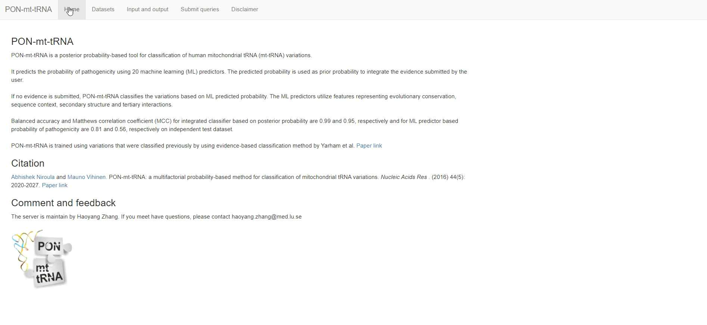

# R shiny server for PON-mt-tRNA
`PON-mt-tRNA` is a posterior probability-based method for classification of mitochondrial tRNA variations.  
It is developed by Abhishek Niroula and Mauno Vihinen at 2016.  
It have been published in *Nucleic Acids Res*, [paper link](http://nar.oxfordjournals.org/content/early/2016/02/02/nar.gkw046.abstract).  

We developed a R shiny server for `PON-mt-tRNA`. You can visit the server at [here](http://lap676.srv.lu.se:8503/pon_mt_trna/).  

The code and data of this project are public available. If you are interested, you can following the below instruction, and run it locally (on your own computer) or public (make it available on the network). 


# Requirements 
- `Linux` with `docker` (If you want to make it available on the network).
- `R (4.2.3)` with `shiny(1.8.0)`, `shinydashboard(0.7.2)`, `DT(0.28)`, `digest(0.6.33)`.
- `Python (3.12.0)` with `pandas(2.1.4)`.
The versions we used are in brackets. Please note that the versions do not necessarily have to be the same. 


# Run PON-mt-tRNA locally
Clone this repository via the commands:
```  
git clone https://github.com/zhanghaoyang0/pon_mt_trna.git
cd pon_mt_trna
Rscript shiny.r
```
Then you will get a local website for PON-mt-tRNA.

If you open it, you will see the introduction, datasets, and server: 




# Run PON-mt-tRNA public (on the network)
You can deposit PON-mt-tRNA with docker, if you have a in a public-access server: 
``` 
docker pull zhanghaoyang0/rshiny
docker run -itd -p 8503:3838 -v path_of_pon_mt_trna:/srv/shiny-server/pon_mt_trna zhanghaoyang0/rshiny
``` 
Then, you can visit PON-mt-tRNA in a port of your server (e.g., xxx.com:8503).


# Feedback and comments
Add an issue or send email to haoyang.zhang@med.lu.se