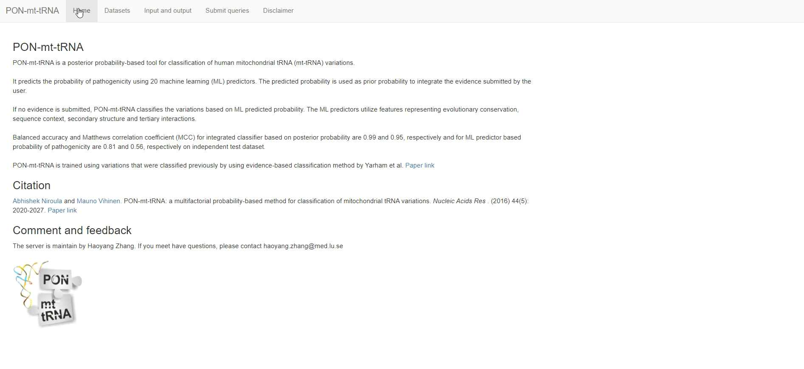

# R shiny server for LU PSB
The Protein Structure and Bioinformatics Lab of Lund University (LU PSB) hosted by [Prof. Mauno Vihinen](https://portal.research.lu.se/en/persons/mauno-vihinen) develops methods and performs analyses to understand biological and medical phenomena at genetic, functional, mechanical and systems level. You can visit our website at [here](https://structure-next.med.lu.se/). 

We provide R shiny server for multiple tools. C ode and data of are public available. 

# Visit our online server
## PON-mt-tRNA
`PON-mt-tRNA` is a posterior probability-based method for classification of mitochondrial tRNA variations. 
Reference  
Abhishek Niroula and Mauno Vihinen.  
PON-mt-tRNA: a multifactorial probability-based method for classification of mitochondrial tRNA variations.
*Nucleic Acids Res*. 2016. [paper link](http://nar.oxfordjournals.org/content/early/2016/02/02/nar.gkw046.abstract). [server link](http://lap676.srv.lu.se:8503/pon_mt_trna/).  

## PON-BTK
`PON-BTK` is a method for classifying variations in the kinase domain of Bruton tyrosine kinase (BTK) related to X-linked agammaglobulinemia (XLA) to disease-causing and harmful.  
Reference  
Jouni Väliaho, Imrul Faisal, Csaba Ortutay, C. I. Edvard Smith and Mauno Vihinen.  
Characterization of all possible single nucleotide change-caused amino acid substitutions in the kinase domain of Bruton tyrosine kinase.
*Hum Mutat*. 2015. [paper link](https://onlinelibrary.wiley.com/doi/full/10.1002/humu.22791). [server link](http://lap676.srv.lu.se:8503/pon_btk/).  

## PON-MMR2
`PON-MMR2` is a machine-learning based tool that classifies amino acid substitutions in mismatch repair (MMR) proteins: MLH1, MSH2, MSH6 and PMS2.  
Reference  
Abhishek Niroula and Mauno Vihinen.  
Classification of amino acid substitutions in mismatch repair proteins using PON-MMR2.
*Hum Mutat*. 2015. [paper link](https://onlinelibrary.wiley.com/doi/full/10.1002/humu.22900). [server link](http://lap676.srv.lu.se:8503/pon_mmr2/). 

# Run the server locally 
If you are interested, you can following the below instruction to run them locally (on your own computer) or public (make it available on the network). 

Here we use `PON-mt-tRNA` as an example. 
## Requirements 
- `Linux` with `docker` (If you want to make it available on the network).
- `R (4.2.3)` with `shiny(1.8.0)`, `shinydashboard(0.7.2)`, `DT(0.28)`, `digest(0.6.33)`.
- `Python (3.12.0)` with `pandas(2.1.4)`.
The versions we used are in brackets. Please note that the versions do not necessarily have to be the same. 

## Deposit in local computer
Clone this repository via the commands:
```  
git clone https://github.com/zhanghaoyang0/lu_psb_rshiny_server.git
cd lu_psb_rshiny_server/pon_mt_trna
Rscript shiny.r
```
Then you will get a local website for `PON-mt-tRNA`.

If you open it, you will see the introduction, datasets, and server: 


## Deposit in public-access server with docker
You can deposit PON-mt-tRNA on the network if you have a in a public-access server: 
``` 
docker pull zhanghaoyang0/rshiny
path="/path_of/lu_psb_rshiny_server"
docker run -itd -p 8503:3838 -v ${path}:/srv/shiny-server zhanghaoyang0/rshiny
``` 
Then, you can visit PON-mt-tRNA in a port of your server (e.g., xxx.com:8503).


# Feedback and comments
Add an issue or send an email to haoyang.zhang@med.lu.se